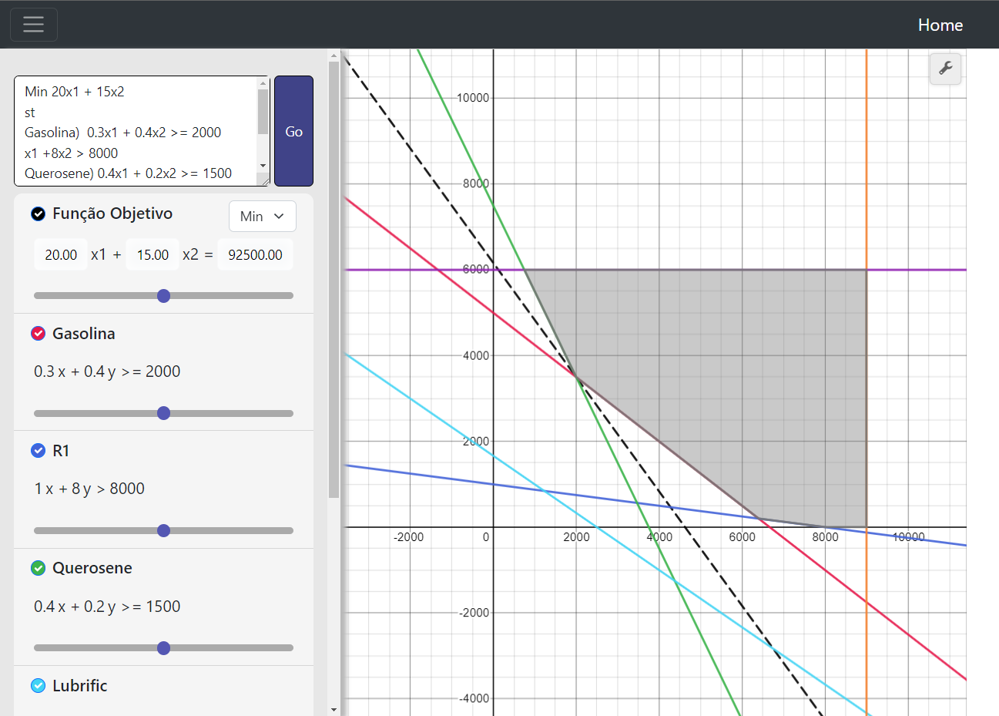

# Graph Sensys
### Trabalho final de curso em Ciência da Computação - UFV. Em construção....
 

## Sobre o projeto:
Aplicação Web para auxiliar no aprendizado em Programação Linear, facilitando a análise de sensibilidade gráfica em problemas típicos da área.

## Instalação:
* Instalar o [NodeJs](https://nodejs.org/en/download). A versão utilizada por mim foi a 18.16.0, mas provavelmente versões mais recentes devem funcionar.
* Dentro da pasta raiz do repositório, executar o comando abaixo no terminal/cmd para instalar as dependências do projeto:

    ``npm install``
    
* Caso o comando acima não funcione, verificar se o ``npm`` está adicionado como uma variável de ambiente. Em instalações Windows geralmente a variável é criada automaticamente na instalação, bastando apenas reiniciar as janelas do cmd abertas para o comando funcionar;

* Para executar o projeto, basta rodar o seguinte comando:
    
    ``npm run dev``
    
    A aplicação estará executando em ``htpp://localhost:3000``. Caso a porta 3000 já esteja em uso pelo sistema, basta alterar a última linha de código do arquivo ``index.js`` para alguma porta disponível e rodar novamente o programa.

## Inputs aceitos pelo programa:
Pretendo detalhar esse tópico em breve, mas temos alguns exemplos em ``/exemplos``.